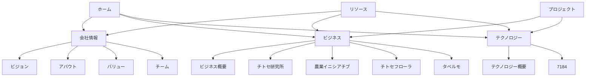

# チトセバイオ.comサイトナビゲーション最適化計画

## 概要
このドキュメントは、chitose-bio.comウェブサイトのナビゲーション構造を最適化するための実装計画を詳述しています。各セクション間のリンクを整理し、ユーザーエクスペリエンスを向上させることを目的としています。

## サイト構造分析

現在のサイト構造を分析した結果、以下のようなカテゴリ分けが適切だと考えられます：

### ビジネス関連
- business/
- chitose-agri-laboratory/
- chitose-agriculture-initiative/
- chitose-flora/
- chitose-laboratory/
- taberumo/

### テクノロジー関連
- 7184/
- technology/

### 共通/会社情報
- home/
- about/
- vision/
- value/
- team/
- projects/（両カテゴリに関連する可能性あり）
- resources/

## リンク最適化計画



## 具体的なリンク実装計画

### 1. ナビゲーションバー（Navbar）の最適化

#### 基本構造
メインメニュー:
- ホーム (`/home/index.jsx`)
- 会社情報（ドロップダウン）
  - ビジョン (`/vision/index.jsx`)
  - アバウト (`/about/index.jsx`)
  - バリュー (`/value/index.jsx`)
  - チーム (`/team/index.jsx`)
- ビジネス（ドロップダウン）
  - ビジネス概要 (`/business/index.jsx`)
  - チトセ研究所 (`/chitose-laboratory/index.jsx`)
  - 農業イニシアチブ (`/chitose-agriculture-initiative/index.jsx`)
  - チトセフローラ (`/chitose-flora/index.jsx`)
  - タベルモ (`/taberumo/index.jsx`)
- テクノロジー（ドロップダウン）
  - テクノロジー概要 (`/technology/index.jsx`)
  - 7184 (`/7184/index.jsx`)
- プロジェクト (`/projects/index.jsx`)
- リソース (`/resources/index.jsx`)

#### Navbar実装例
```jsx
// 各セクションのNavbar1.jsxファイルを以下のように更新する

// リンク構造
<a href="/home/index.jsx" className="...">ホーム</a>

// 会社情報ドロップダウン
<div onMouseEnter={useActive.openOnDesktopDropdownMenu} onMouseLeave={useActive.closeOnDesktopDropdownMenu}>
  <button className="..." onClick={useActive.openOnMobileDropdownMenu}>
    <span>会社情報</span>
    <motion.span ...><RxChevronDown /></motion.span>
  </button>
  <AnimatePresence>
    <motion.nav ...>
      <a href="/vision/index.jsx" className="...">ビジョン</a>
      <a href="/about/index.jsx" className="...">アバウト</a>
      <a href="/value/index.jsx" className="...">バリュー</a>
      <a href="/team/index.jsx" className="...">チーム</a>
    </motion.nav>
  </AnimatePresence>
</div>

// ビジネスドロップダウン
<div onMouseEnter={...} onMouseLeave={...}>
  <button className="..." onClick={...}>
    <span>ビジネス</span>
    <motion.span ...><RxChevronDown /></motion.span>
  </button>
  <AnimatePresence>
    <motion.nav ...>
      <a href="/business/index.jsx" className="...">ビジネス概要</a>
      <a href="/chitose-laboratory/index.jsx" className="...">チトセ研究所</a>
      <a href="/chitose-agriculture-initiative/index.jsx" className="...">農業イニシアチブ</a>
      <a href="/chitose-flora/index.jsx" className="...">チトセフローラ</a>
      <a href="/taberumo/index.jsx" className="...">タベルモ</a>
    </motion.nav>
  </AnimatePresence>
</div>

// テクノロジードロップダウン
<div onMouseEnter={...} onMouseLeave={...}>
  <button className="..." onClick={...}>
    <span>テクノロジー</span>
    <motion.span ...><RxChevronDown /></motion.span>
  </button>
  <AnimatePresence>
    <motion.nav ...>
      <a href="/technology/index.jsx" className="...">テクノロジー概要</a>
      <a href="/7184/index.jsx" className="...">7184</a>
    </motion.nav>
  </AnimatePresence>
</div>

// 単一リンク
<a href="/projects/index.jsx" className="...">プロジェクト</a>
<a href="/resources/index.jsx" className="...">リソース</a>
```

#### 現在のセクションの強調表示
各セクションで現在のページを強調表示するロジックを追加します：

```jsx
// 各Navbar1.jsxファイルに追加
// 例：visionセクションのNavbar1.jsx
// 現在のパスがvisionの場合、それを強調表示する

// 現在のパスを取得するヘルパー関数（ファイルの冒頭に追加）
const getCurrentPath = () => {
  // ブラウザ環境でのみ実行
  if (typeof window !== 'undefined') {
    return window.location.pathname;
  }
  return '';
};

// コンポーネント内で使用
const currentPath = getCurrentPath();
const isVision = currentPath.includes('vision');

// 該当するリンクのclassNameに条件付きでアクティブクラスを追加
<a 
  href="/vision/index.jsx" 
  className={`... ${isVision ? 'font-bold text-primary' : ''}`}
>
  ビジョン
</a>
```

### 2. フッター（Footer）の最適化

#### 基本構造
3カラム構成:
- コラム1：会社情報（ビジョン、アバウト、バリュー、チーム）
- コラム2：ビジネス関連（全ビジネスカテゴリ）
- コラム3：テクノロジー関連（全テクノロジーカテゴリとプロジェクト）

#### Footer実装例
```jsx
// 各セクションのFooter2.jsxファイルを以下のように更新

<div className="flex flex-col items-start justify-start">
  <h2 className="mb-3 font-semibold md:mb-4">会社情報</h2>
  <ul>
    <li className="py-2 text-sm">
      <a href="/vision/index.jsx" className="flex items-center gap-3">ビジョン</a>
    </li>
    <li className="py-2 text-sm">
      <a href="/about/index.jsx" className="flex items-center gap-3">アバウト</a>
    </li>
    <li className="py-2 text-sm">
      <a href="/value/index.jsx" className="flex items-center gap-3">バリュー</a>
    </li>
    <li className="py-2 text-sm">
      <a href="/team/index.jsx" className="flex items-center gap-3">チーム</a>
    </li>
  </ul>
</div>

<div className="flex flex-col items-start justify-start">
  <h2 className="mb-3 font-semibold md:mb-4">ビジネス</h2>
  <ul>
    <li className="py-2 text-sm">
      <a href="/business/index.jsx" className="flex items-center gap-3">ビジネス概要</a>
    </li>
    <li className="py-2 text-sm">
      <a href="/chitose-laboratory/index.jsx" className="flex items-center gap-3">チトセ研究所</a>
    </li>
    <li className="py-2 text-sm">
      <a href="/chitose-agriculture-initiative/index.jsx" className="flex items-center gap-3">農業イニシアチブ</a>
    </li>
    <li className="py-2 text-sm">
      <a href="/chitose-flora/index.jsx" className="flex items-center gap-3">チトセフローラ</a>
    </li>
    <li className="py-2 text-sm">
      <a href="/taberumo/index.jsx" className="flex items-center gap-3">タベルモ</a>
    </li>
  </ul>
</div>

<div className="flex flex-col items-start justify-start">
  <h2 className="mb-3 font-semibold md:mb-4">テクノロジー</h2>
  <ul>
    <li className="py-2 text-sm">
      <a href="/technology/index.jsx" className="flex items-center gap-3">テクノロジー概要</a>
    </li>
    <li className="py-2 text-sm">
      <a href="/7184/index.jsx" className="flex items-center gap-3">7184</a>
    </li>
    <li className="py-2 text-sm">
      <a href="/projects/index.jsx" className="flex items-center gap-3">プロジェクト</a>
    </li>
    <li className="py-2 text-sm">
      <a href="/resources/index.jsx" className="flex items-center gap-3">リソース</a>
    </li>
  </ul>
</div>
```

## 実装ステップ

### ステップ1：共通ナビゲーション構造の定義
- すべてのページで一貫したナビゲーション構造を使用
- 各セクションは同じリンク構造を持つが、現在のセクションを強調表示

### ステップ2：各セクションのNavbar実装
- 各セクションのNavbar1.jsxファイルを更新
- ドロップダウンメニュー構造を実際のカテゴリを反映するように調整
- 各リンクを適切なパスに更新

### ステップ3：各セクションのFooter実装
- 各セクションのFooter2.jsxファイルを更新
- 3カラムのリンク構造を実装
- 各リンクを適切なパスに更新

### ステップ4：現在のセクション強調表示ロジック
- 各セクションのNavbarコンポーネントに現在のパスを検出するロジックを追加
- 現在のセクションに応じてリンクのスタイルを変更

## 技術的な考慮事項

### SEO最適化
- 各リンクには意味のあるラベルを使用
- 適切なalt属性を画像に付与

### アクセシビリティ
- すべてのリンクとボタンは適切なaria属性を持つべき
- キーボードナビゲーションをサポート

### モバイル対応
- 現在のモバイルメニュー機能を維持
- タッチフレンドリーなインタラクションを確保

## 次のステップ
この計画をCodeモードに切り替えて実装することを推奨します。実装は各セクションのコンポーネントを一つずつ更新することで、段階的に進めることができます。