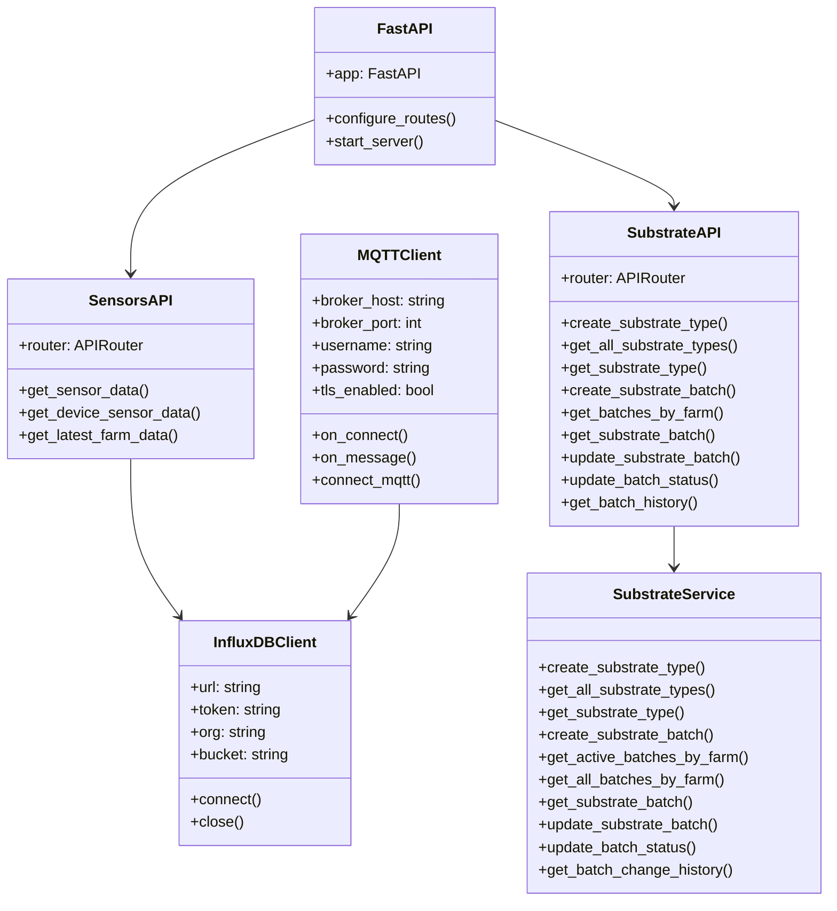
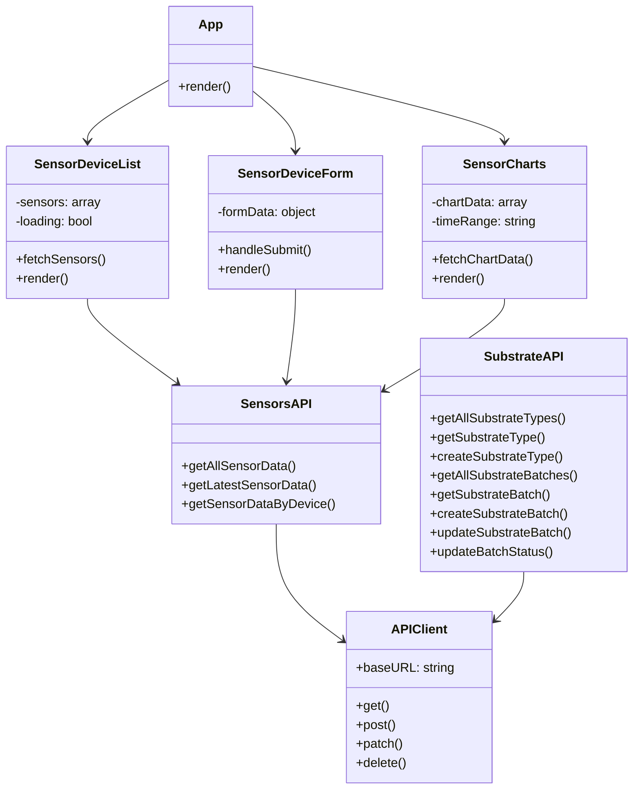

# Component Diagrams

This document provides detailed component diagrams for the BSF Larvae Monitoring System.

## Backend Components

```mermaid
classDiagram
    class FastAPI {
        +app: FastAPI
        +configure_routes()
        +start_server()
    }
    
    class SensorsAPI {
        +router: APIRouter
        +get_sensor_data()
        +get_device_sensor_data()
        +get_latest_farm_data()
    }
    
    class SubstrateAPI {
        +router: APIRouter
        +create_substrate_type()
        +get_all_substrate_types()
        +get_substrate_type()
        +create_substrate_batch()
        +get_batches_by_farm()
        +get_substrate_batch()
        +update_substrate_batch()
        +update_batch_status()
        +get_batch_history()
    }
    
    class InfluxDBClient {
        +url: string
        +token: string
        +org: string
        +bucket: string
        +connect()
        +close()
    }
    
    class MQTTClient {
        +broker_host: string
        +broker_port: int
        +username: string
        +password: string
        +tls_enabled: bool
        +on_connect()
        +on_message()
        +connect_mqtt()
    }
    
    class SubstrateService {
        +create_substrate_type()
        +get_all_substrate_types()
        +get_substrate_type()
        +create_substrate_batch()
        +get_active_batches_by_farm()
        +get_all_batches_by_farm()
        +get_substrate_batch()
        +update_substrate_batch()
        +update_batch_status()
        +get_batch_change_history()
    }
    
    FastAPI --> SensorsAPI
    FastAPI --> SubstrateAPI
    SensorsAPI --> InfluxDBClient
    SubstrateAPI --> SubstrateService
    MQTTClient --> InfluxDBClient
```

## Frontend Components

```mermaid
classDiagram
    class App {
        +render()
    }
    
    class SensorDeviceList {
        -sensors: array
        -loading: bool
        +fetchSensors()
        +render()
    }
    
    class SensorDeviceForm {
        -formData: object
        +handleSubmit()
        +render()
    }
    
    class SensorCharts {
        -chartData: array
        -timeRange: string
        +fetchChartData()
        +render()
    }
    
    class APIClient {
        +baseURL: string
        +get()
        +post()
        +patch()
        +delete()
    }
    
    class SensorsAPI {
        +getAllSensorData()
        +getLatestSensorData()
        +getSensorDataByDevice()
    }
    
    class SubstrateAPI {
        +getAllSubstrateTypes()
        +getSubstrateType()
        +createSubstrateType()
        +getAllSubstrateBatches()
        +getSubstrateBatch()
        +createSubstrateBatch()
        +updateSubstrateBatch()
        +updateBatchStatus()
    }
    
    App --> SensorDeviceList
    App --> SensorDeviceForm
    App --> SensorCharts
    SensorDeviceList --> SensorsAPI
    SensorDeviceForm --> SensorsAPI
    SensorCharts --> SensorsAPI
    SensorsAPI --> APIClient
    SubstrateAPI --> APIClient
```
