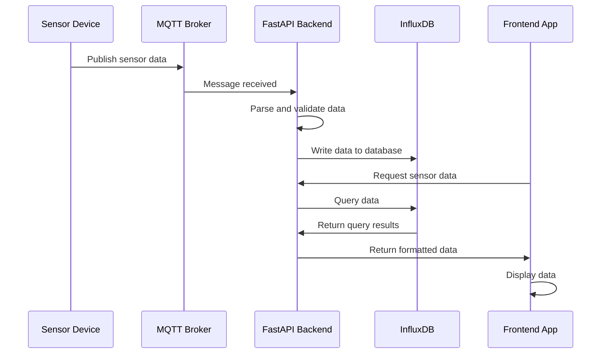
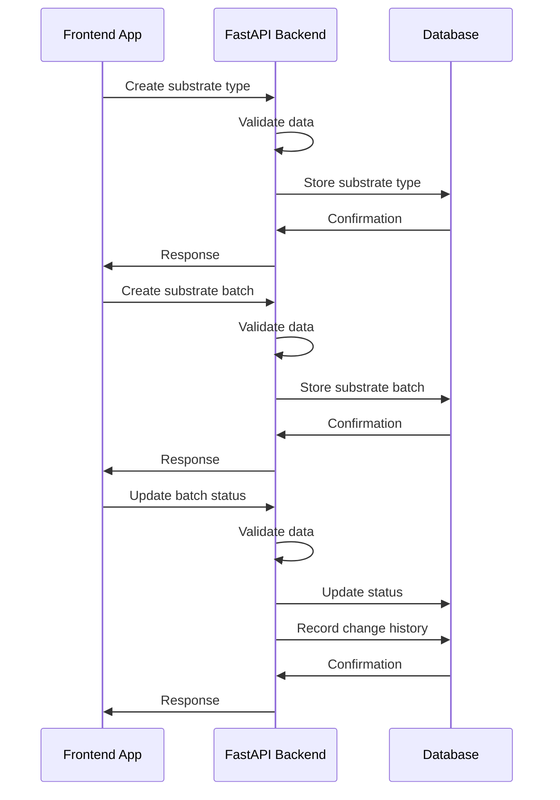

# Data Flow

This document describes the data flow within the BSF Larvae Monitoring System.

## Sensor Data Flow



## Substrate Management Flow



## MQTT Topic Structure

The system uses the following MQTT topic structure:

```
bsf/{farm_id}/{device_type}/{device_id}
```

Example topics:
- `bsf/farm001/temperature/device001`
- `bsf/farm001/humidity/device002`
- `bsf/farm001/pressure/device003`

## MQTT Payload Format

```json
{
  "timestamp": "2023-01-01T00:00:00Z",
  "measurements": {
    "temperature": 25.5,
    "humidity": 60,
    "pressure": 1013.25
  }
}
```

## InfluxDB Data Model

The system uses InfluxDB to store time-series data with the following structure:

- Measurement: `sensor_data`
- Tags:
  - `farm_id`: The ID of the farm
  - `device_id`: The ID of the device
  - `device_type`: The type of device (e.g., temperature, humidity)
- Fields: Varies depending on the sensor type (e.g., temperature, humidity, pressure)
- Time: Timestamp of the measurement
